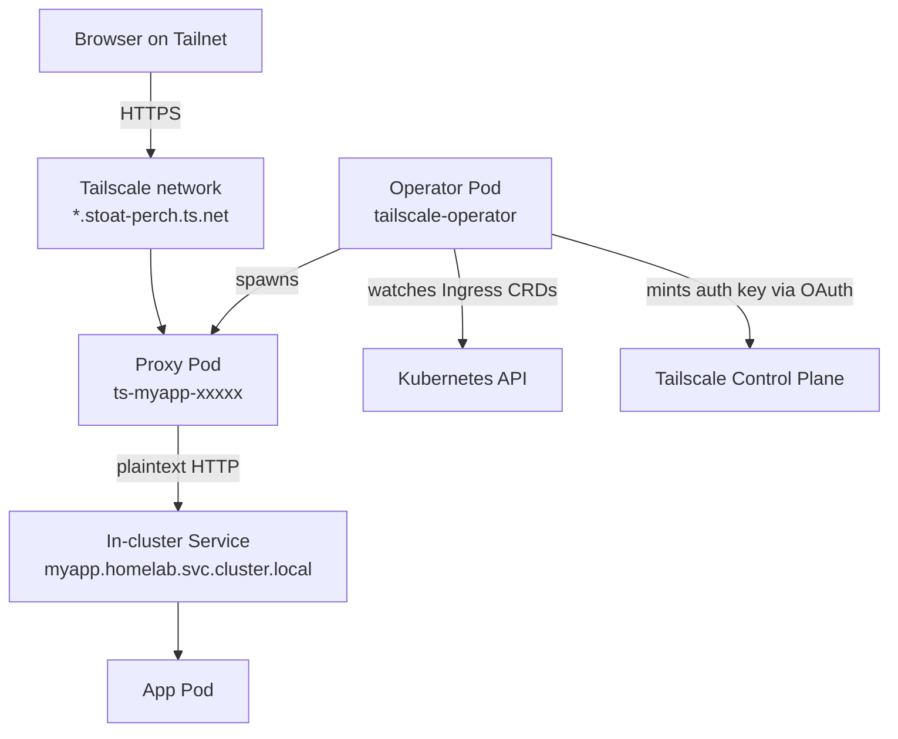

# Tailscale Operator — Architecture & Tech Stack

**On this page:** [Deployment diagram](#deployment-diagram) · [What is it](#what-is-it) · [Tech stack](#tech-stack) · [Source code](#source-code) · [Local config files](#local-config-files) · [How it works](#how-it-works) · [Current Ingresses](#current-ingresses) · [Tagged devices](#tagged-devices) · [Design decisions](#design-decisions) · [What's NOT used](#whats-not-used) · [Reference](#reference)

## Deployment diagram



## What is it

The Tailscale [Kubernetes Operator](https://tailscale.com/kb/1236/kubernetes-operator) automatically attaches cluster Services + Ingresses to your tailnet, so they're reachable from any Tailscale-connected device with auto-issued HTTPS certs and clean URLs.

## Tech stack

| Layer | Tech |
|---|---|
| Operator | `tailscale/k8s-operator` (Go) |
| Chart | `tailscale/tailscale-operator` (Helm) v1.98.x |
| Proxy pods | `tailscale/tailscale` (one per Ingress) |
| Auth | OAuth client with `devices:write` + `auth_keys:write` scopes |
| HTTPS | Tailscale-issued certs via Let's Encrypt-style provisioning |
| Cluster | k3s in OrbStack |
| Namespace | `tailscale` (operator + per-Ingress proxy pods) |

## Source code

**Off-the-shelf** — no custom code.

| | |
|---|---|
| Upstream code | https://github.com/tailscale/tailscale |
| Helm chart | https://github.com/tailscale/tailscale/tree/main/cmd/k8s-operator/deploy/chart |
| Docs | https://tailscale.com/kb/1236/kubernetes-operator |

## Local config files

| | |
|---|---|
| Operator config | Helm release `tailscale-operator` in `tailscale` namespace |
| OAuth credentials | Secret `operator-oauth` in `tailscale` namespace |
| Ingress definitions | In each app's k8s YAML (Jellyfin, Immich, Grocy, etc.) |

## How it works

```
1. You write:
   apiVersion: networking.k8s.io/v1
   kind: Ingress
   metadata: { name: myapp }
   spec:
     ingressClassName: tailscale
     tls: [{ hosts: [myapp] }]

2. Operator sees the Ingress:
   - Mints a Tailscale auth key (via OAuth client)
   - Spawns a small `ts-myapp-xxxxx-0` proxy pod
   - Proxy pod joins your tailnet as device `myapp`
   - Provisions HTTPS cert for myapp.stoat-perch.ts.net

3. Browser requests https://myapp.stoat-perch.ts.net:
   - Tailscale routes the request to the proxy pod
   - Proxy terminates HTTPS
   - Proxy forwards plaintext HTTP to the in-cluster Service
   - Service routes to the app pod
```

## Current Ingresses

| Hostname | Service |
|---|---|
| `jellyfin.stoat-perch.ts.net` | jellyfin |
| `immich.stoat-perch.ts.net` | immich-server |
| `docs.stoat-perch.ts.net` | docs |
| `grocy.stoat-perch.ts.net` | grocy |
| `emailmatrix.stoat-perch.ts.net` | emailmatrix |
| `chores.stoat-perch.ts.net` | chores-frontend (from other Claude session) |

List live: `kubectl get ingress -n homelab`.

## Tagged devices

Proxy pods join the tailnet as **tagged devices** (with `tag:k8s` and similar), not under your user account. Visible in admin console under "Tagged devices". They count against your tailnet's device limit (100 free tier).

## Design decisions

- **Operator pattern over manual `tailscale up`** — automatic + declarative. New apps just need to add `ingressClassName: tailscale` to their Ingress.
- **One proxy pod per Ingress** — clean isolation. If one app's traffic surges, it doesn't affect others.
- **OAuth client over auth keys** — keys expire; OAuth lets the operator mint fresh keys as needed for new proxies.
- **HTTPS certs auto-issued** — no Let's Encrypt configuration needed on your end. Tailscale handles it.
- **Subdomain-only `tls.hosts`** — `tls: [{ hosts: [myapp] }]` (NOT the full hostname). Operator appends `.<tailnet>.ts.net`.

## What's NOT used

- **Subnet router mode** — would expose local LAN devices to tailnet members. Not currently configured (would need separate `Connector` CRD).
- **Egress proxies** — would let pods reach outside Tailscale services. Not needed currently.
- **Tailscale Funnel** — public-internet exposure (not just tailnet). Not enabled — homelab is intentionally tailnet-private.

## Reference

- Operator docs: https://tailscale.com/kb/1236/kubernetes-operator
- Ingress patterns: https://tailscale.com/kb/1439/kubernetes-operator-cluster-ingress
- ACL tags: https://tailscale.com/kb/1068/acl-tags
